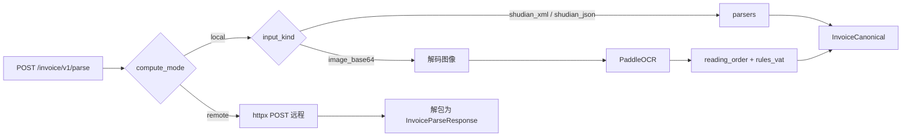

# 工程说明

## 仓库目录结构

```
paddleocr-service/
├── app/                          # Python 应用包（FastAPI）
│   ├── main.py                   # 创建 FastAPI、挂载路由
│   ├── config.py                 # pydantic-settings：服务名、版本、发票/远程默认值
│   ├── core/
│   │   └── ocr_engine.py         # PaddleOCR 单例、图像解码、结果解析、run_ocr_on_bgr
│   ├── models/
│   │   └── invoice.py            # InvoiceParseRequest / InvoiceParseResponse / InvoiceCanonical
│   ├── parsers/
│   │   ├── shudian_map.py        # 扁平 key → 标准发票字段（正则别名，按渠道扩展）
│   │   ├── shudian_xml.py        # XML/JSON 文本 → 扁平 dict → canonical
│   │   └── common.py             # invoice_from_mapped 组装模型
│   ├── extractors/
│   │   ├── reading_order.py      # OCR 框阅读顺序（纵→横）
│   │   └── rules_vat.py          # 影像票面启发式正则（增值税常见字样）
│   ├── services/
│   │   ├── invoice_facade.py     # compute_mode 分发；local 内含数电解析与影像 OCR+规则
│   │   └── invoice_remote.py     # httpx 调用远程，响应解包
│   └── routers/
│       ├── meta.py               # GET /, /health, /languages
│       ├── ocr.py                # POST /ocr, /ocr/base64, /ocr/url, /ocr/batch
│       └── invoice.py            # POST /invoice/v1/parse
├── docs/                         # 本文档
├── Dockerfile.base               # 基础镜像
├── Dockerfile                    # 应用镜像：COPY app + start.sh
├── build-base.sh / build-app.sh
├── requirements.txt
├── start.sh                      # exec uvicorn app.main:app --workers 1
└── README.md
```

说明：本地发票解析（数电 + 影像）当前集中在 **`invoice_facade.py`** 的 `parse_local`；若逻辑继续膨胀，可再拆为 `invoice_local.py`。

---

## 请求处理流水线（发票）



- **数电路径**：无深度学习推理，CPU 占用低；准确度依赖 **渠道字段名** 与 `shudian_map` 中别名是否一致。
- **影像路径**：本机 CPU + MKLDNN；结构化质量依赖版式与 `rules_vat` 规则，复杂版式需迭代规则或改走 `remote`。

---

## 启动与进程模型

- 容器入口：`start.sh` → `uvicorn app.main:app --host 0.0.0.0 --port 8088 --workers 1`。
- **`workers=1`**：PaddleOCR 模型常驻内存较大，多 worker 会成倍占用内存；水平扩展建议多容器 + 前置负载均衡。

---

## Docker 构建与运行

**完整说明（两层镜像、脚本参数、`build-arg`、何时重建、常见问题）见 [docker-build.md](docker-build.md)。**

此处仅保留与代码结构相关的摘要：

- **基础镜像** `Dockerfile.base`：系统依赖 + `pip install -r requirements.txt` + 可选预拉模型。
- **应用镜像** `Dockerfile`：`FROM` 上述基础镜像，仅复制 `app/` 与 `start.sh`。
- **日常只改业务**：只需 `./build-app.sh`；改依赖或 `Dockerfile.base` 后再执行 `./build-base.sh`。

## 常用运维命令

```bash
docker stop paddleocr-service
docker start paddleocr-service
docker logs -f paddleocr-service
docker rm -f paddleocr-service
```

## 环境变量

| 变量 | 说明 |
|------|------|
| `service_name` / `service_version` | 与 `app/config.py` 字段对应；可通过 `.env` 或环境变量覆盖（命名以 pydantic-settings 解析为准） |
| `DEFAULT_INVOICE_COMPUTE_MODE` | `local` 或 `remote` |
| `INVOICE_REMOTE_BASE_URL` | `remote` 必填，根 URL，无尾部斜杠也可 |
| `INVOICE_REMOTE_PARSE_PATH` | 默认 `/v1/parse` |
| `INVOICE_REMOTE_API_KEY` | 可选；设置则添加 `Authorization: Bearer ...` |
| `INVOICE_REMOTE_TIMEOUT_SEC` | 默认 `30` |
| `INVOICE_LOCAL_IMAGE_MAX_BYTES` | 默认 `12582912`（约 12MB），影像 Base64 解码后大小上限 |

pydantic-settings 会将字段名映射为常见的大写环境变量形式（如 `INVOICE_REMOTE_BASE_URL`）。

---

## 扩展数电票字段映射

编辑 **`app/parsers/shudian_map.py`**：

- **`normalize_key` / `key_candidates`**：同时支持「短标签名」与「带路径的 JSON/XML 扁平 key」，避免 `Header.FpHm` 类路径匹配不到。
- **`_ALIASES`**：为 `(正则, canonical_field_name)`，canonical 名与 `InvoiceCanonical` 字段一致。
- 若渠道使用 **完全不同的语义模型**，可在 `shudian_xml.py` 的 walk/flatten 层增加专用分支，再汇入 `map_flat_to_canonical`。

---

## 扩展影像规则

编辑 **`app/extractors/rules_vat.py`**：增加/收紧正则，或按模板分函数并在 `extract_from_ocr_lines` 中分支。建议配合固定版式的 **脱敏样本集** 做回归，避免误伤其他版式。

---

## 本地开发（非 Docker）

需与容器相近的 Python 与系统库（PaddlePaddle CPU 等），自行解决本机依赖差异。

```bash
python3 -m venv .venv
source .venv/bin/activate   # Windows: .venv\Scripts\activate
pip install -r requirements.txt
uvicorn app.main:app --host 0.0.0.0 --port 8088 --workers 1
```

---

## 安全与合规建议

- 日志中避免打印完整 `payload`（含 Base64 影像或整张发票 XML）。
- `invoice.extra` 在 OCR 路径可能含 `ocr_full_text` 预览，对外返回前可按策略裁剪或脱敏。
- 生产环境务必 **HTTPS** Termination 在网关或 Ingress。

---

## 依赖版本锁定

以 **`requirements.txt`** 为准；升级 Paddle 或 FastAPI 后务必重新跑通 OCR 与发票样例，并视情况重建基础镜像。
